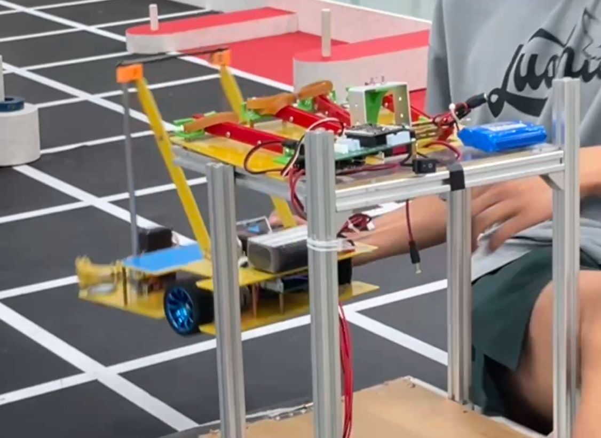

# Against-Robots #
## 浙江省机器人省赛运输机器人项目（对抗机器人） ##
​	2022届对抗的改动在2021届的基础上改动不大，我对这次的比赛做了次总结，列出几个不足之处和可改动的地方，

并打算重行设计机械模型对这次暴露出的问题进行针对行设计。（更新中）

---------
### 这次暴露的不足之处 ###
   #### 第一点
​	我们的小车比较依赖场地，需要对场地进行一定的量的调试才可以适应这个场地，而参赛的其他的队伍
可以用机械进行强行修正（机械限位）。例如  

​	杭电母车机械限位：

​	其他学校的机械限位：

   #### 第二点

​	比赛场上参赛时过于紧张，导致有点手忙脚乱。

   #### 第三点
​	比赛时我们的策略暴露过早泄露出去了。

   #### 第四点
​	重心偏高不稳定，铅块的位置不完美运动时有问题，速度提不上去。

   #### 第五点

​	循迹前进怕判断有问题，应该用过来最后一个循迹才判断过线，否则有时会少判断一格。

#### 第六点

​	路线走的少了，可以多走点在，比如中间护段时间能量环后在开始走，毕竟母车只有一次动的机会，2分钟后在动说不定有奇效

------

### 好的想法和可借鉴的设计和策略

#### 第一点

​	上面说的机械限位。

#### 第二点

​	在车的下方可以收取能量环，既能保护能量环又可以不让敌人拿到能量环。

特别快的小车（中间可以收集能量环）：

#### 第三点

​	设计挺新颖的可以拓宽自己的思路，不多说直接上图

#### 第四点

​	小车速度特别快，快到别人反应不过来。敌人走到一半就已经进环了。

根本拦不住的小车：

#### 第五点

​	用电机收集能量环，这种一半计较大，纺织的：

为放下的状态：

这个也是电机滚上去的：

#### 第六点

​	不用循迹，直接上激光雷达，其他的转了几乎就废了，但是这个可以修回来，唯一的队伍是温职，不可否认的强，但陀螺仪也是真的好~~(贵，也就大几千)~~，应对方法，1冲过去把他翘起来，2冲过去把他包起来，但这都比较难，他跑的太快了：

#### 第七点

​	母车分身（说是一车其实是多车），比如工商等等学校都是：

工商~~（有个美女挺好看的，嘿嘿，我剪掉了）~~：

一车三用：

#### 第八点

​	母车的弹射装置，比赛中，当敌人小车出来就弹出东西，敌人就不能动了，非常恶心的战术，就算不用也得考虑应对的对策，比如自己的小车直接多路线融合或者直接抵住敌人小车不重启，但是敌人有两移动的母车。

#### 第九点

​	在调试的时候我想到的，可以在弹射出的装置上加个什么东西，然后盖在三倍能量环的柱子上，这样他们放不上去环，如果可以还可以装个挂帘，还可以拦住对方的子车。但是这一步难度较高需要多尝试，而且要快，不然都放进去了你阻止个锤子。

#### 第十点

​	结合难度考虑是否加视觉，在敌人的能量区，跨过能量台用机械臂直接拿环。还有一点好处是可以捡起被打乱的环。

#### 第十一点

​	注意这次其他队伍觉得母车太强，会直接冲过来，要充分考虑路径尽快躲避这种情况。

#### 第十二点

​	模块化设计，但是机械设计难度太大，各种模块替换可现场变更战术。

#### 第十三点

​	可以的话上ros建图~~（我在想屁吃啊，快来打我的脸）~~。